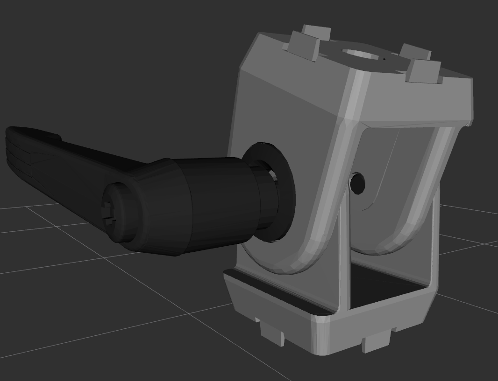

lockmount_description
=======================

This package contains a single URDF macro used to add a manually-adjustable, locking mount used for cameras and other
sensors.



To add the mount to your URDF, add e.g.

```xml
<xacro:include filename="$(find lockmount_description)/urdf/lockmount.urdf.xacro" />
<xacro:lockmount prefix="front_camera" parent_link="front_mount" angle="${pi/8}">
  <origin xyz="0 0 0" rpy="0 0 0" />
</xacro:lockmount>

<xacro:sensor_d435 parent="front_camera_mount" name="front_realsense">
  <origin xyz="0 0 0" rpy="0 0 0" />
</xacro:sensor_d435>
```

The `prefix` parameter is prepended to all the joints and links inside the macro to ensure uniqueness.

The `parent_link` parameter defines the parent of the lockmount.  The macro automatically creates a fixed
joint between `parent_link` and `${prefix}_base_link`.

The `angle` parameter is the pitch angle of the mount.  This angle is assumed to be fixed, as the lockmount
is manually adjusted.

The mounting surface of the mount is `${prefix}_mount`, which may be used as the parent link for other URDF joints,
as shown in the example above.
